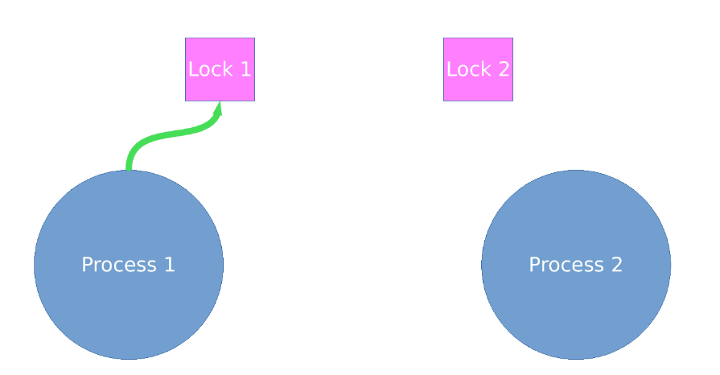
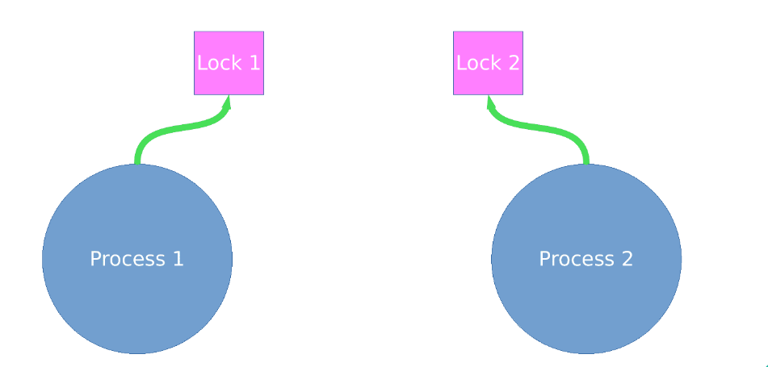
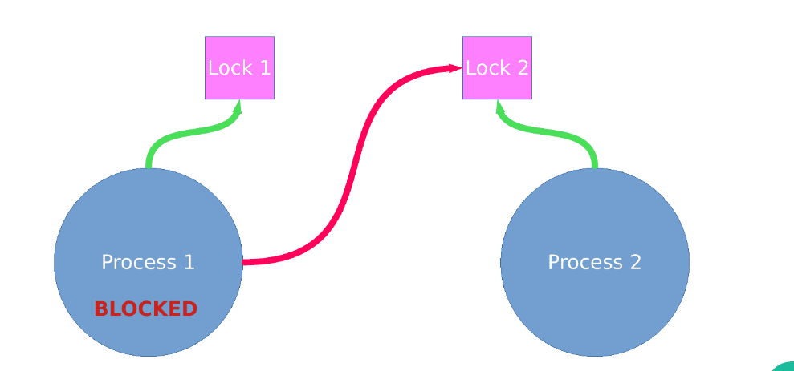
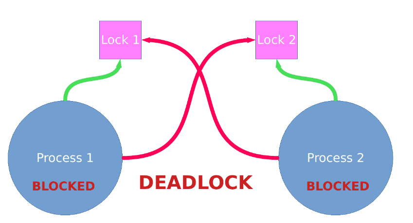

# Concurrent Programming issue

#### Daftar Isi

- [Paradigma Concurrent](#paradigma-concurrent)

  - [Overview](#overview)
  - [Concurrent vs Asynchronous](#concurrent-vs-asynchronous)

- [Implementasi pada Bahasa Pemrograman](#implementasi-pada-bahasa-pemrograman)

  - [Bahasa yang Mendukung Concurrent](#bahasa-pemrograman-yang-mendukung-concurrent)
  - [Pros/Cons](#proscons-setiap-bahasa-pemrograman)

- [Studi Kasus](#studi-kasus)

  - [Race Condition](#race-condition)
  - [Deadlock](#deadlock)

---

## Paradigma Concurrent
.png)
### Overview

#### Concurrency
Concurrency berarti multiple computations yang terjadi secara bersamaan tanpa harus menunggu computation lainnya diselesaikan terlebih dahulu. 
Dalam pemrograman modern, concurrency sangat penting karena: [1][2]

1. Situs web harus menangani banyak pengguna secara bersamaan.
2. Aplikasi mobile sering melakukan pemrosesan di server ("di cloud").
3. Graphical user interfaces memerlukan pekerjaan latar belakang yang tidak mengganggu pengguna.

#### Concurrent Programming 
Concurrent Programming adalah model pemrograman yang memungkinkan berbagai bagian dari program berjalan secara concurrent atau tumpang tindih. 
Dalam pemrograman ini, kamu dapat menulis kode yang memungkinkan berbagai proses atau thread untuk bekerja bersama tanpa harus menunggu salah satu selesai sebelum yang lainnya dimulai. 
Dengan menggunakan teknik seperti threads, processes, atau coroutines, concurrent programming menjadi landasan penting untuk meningkatkan efisiensi dan kecepatan eksekusi
pada sistem modern.[1][2]

#### Dua Model Concurrent programming
Ada dua model umum untuk Concurrent programming: [1]

1. Shared Memory: Modul-modul yang berjalan secara bersamaan berinteraksi dengan membaca dan menulis objek yang dibagikan dalam memori.
2. Message Passing: Modul-modul berinteraksi dengan mengirim pesan melalui saluran komunikasi, di mana pesan yang masuk dikelola dalam antrean.

### Concurrent vs Asynchronous vs MultiThread vs Parallel

#### Concurrency :
Concurrency adalah konsep di mana banyak tugas dapat berjalan tumpang tindih atau bersamaan. 
Di sistem multi-core, beberapa tugas bisa berjalan benar-benar paralel, tetapi pada sistem dengan satu CPU, 
eksekusi dilakukan secara bergantian dengan cepat menggunakan time-slicing. Ini memungkinkan satu program untuk menangani beberapa tugas sekaligus, 
seperti menangani beberapa koneksi klien di server web.[4]

#### Asynchronus :
Asynchronus programming berfokus pada penanganan tugas-tugas yang memerlukan operasi I/O, 
di mana satu tugas dapat menunggu (misalnya saat menunggu data dari jaringan atau disk) tanpa menghentikan seluruh aplikasi. 
Pada pemrograman sinkron biasa, sebuah thread akan diblokir saat menunggu operasi I/O selesai. Dalam pemrograman asinkron, 
tugas tidak akan memblokir thread utama, tetapi akan menjalankan tugas lainnya selama menunggu hasil operasi. 
Ini sering digunakan pada sistem yang banyak berurusan dengan operasi I/O yang lambat.[4]

#### MultiThread :
Multithreading adalah konsep di mana sebuah proses dibagi menjadi beberapa unit kecil yang disebut thread.
Thread-thread ini dapat berjalan secara bersamaan, memungkinkan aplikasi untuk melakukan beberapa **tugas** secara bersamaan.

#### Parallel :
Parallelism adalah konsep di mana beberapa tugas dapat benar-benar berjalan secara bersamaan, biasanya pada sistem multi-core.
Ini memungkinkan aplikasi untuk memanfaatkan kekuatan pemrosesan dari **beberapa core CPU** secara bersamaan,
meningkatkan kecepatan eksekusi secara signifikan.


#### Perbedaan Concurrency dengan Asynchronus, Multithreading, dan Parallel:
**Concurrency** berfokus pada menjalankan banyak tugas yang tumpang tindih dalam satu atau beberapa thread. 
Di sini, pemrograman biasanya melibatkan sinkronisasi dan manajemen thread agar tidak terjadi konflik data atau masalah seperti race conditions. 
Sedangkan Asynchronous Programming fokus pada operasi I/O yang lambat, di mana alih-alih memblokir seluruh program saat menunggu hasil dari operasi tersebut, 
thread dapat melanjutkan tugas lain. Ini membuat pemrograman asinkron lebih efisien dalam menangani operasi I/O daripada pendekatan concurrent yang sinkron.[3][4]
Concurrency berfokus pada menjalankan banyak tugas yang tumpang tindih dalam satu atau beberapa thread. Di sini, pemrograman biasanya melibatkan sinkronisasi dan 
manajemen thread agar tidak terjadi konflik data atau masalah seperti race conditions. Sedangkan Asynchronous Programming fokus pada operasi I/O yang lambat, 
di mana alih-alih memblokir seluruh program saat menunggu hasil dari operasi tersebut, thread dapat melanjutkan tugas lain. Ini membuat pemrograman asinkron 
lebih efisien dalam menangani operasi I/O daripada pendekatan concurrent yang sinkron. Sementara itu, multithreading dan parallelism adalah teknik untuk meningkatkan concurrency, 
tetapi dengan pendekatan yang berbeda: multithreading mengizinkan beberapa thread dalam satu proses, sedangkan parallelism membagi tugas ke dalam beberapa CPU untuk dieksekusi bersamaan.

### Kesimpulan
**Concurrency, Asynchronous Programming, Multithreading, dan Parallelism adalah teknik untuk mencapai concurrency**, 
tetapi masing-masing melakukannya dengan cara yang berbeda. Asynchronous programming lebih fokus pada pengelolaan waktu dan penanganan data yang tidak terduga, 
memungkinkan tugas menunggu tanpa memblokir aplikasi. Sementara itu, multithreading berfokus pada pemanfaatan sumber daya CPU dengan menjalankan beberapa tugas secara bersamaan, 
sehingga meningkatkan responsivitas dan efisiensi. Parallelism juga bertujuan untuk meningkatkan concurrency dengan membagi tugas ke beberapa core CPU untuk eksekusi simultan, mempercepat waktu pemrosesan.

#### Referensi
[1] [MIT Concurrency](https://web.mit.edu/6.005/www/fa14/classes/17-concurrency/).

[2] [Medium Concurrent Programming](https://fuadydheo.medium.com/concurrent-programming-76a548cc47b).

[3] [Medium Concurrency vs Asynchronus](https://medium.com/@suryanshshrivastava_75738/concurrency-asynchronous-programming-and-multithreading-724340dec4df).

[4] [ChatGPT](https://chatgpt.com/share/66f506a8-1370-8008-95e2-7077ebbcc570)

---

## Implementasi pada Bahasa Pemrograman
.png)
### Bahasa Pemrograman yang Mendukung Concurrent

### 1. Java

<p align="center">
  
  </br>
  <sub>Java logo by <a href="https://github.com/SAWARATSUKI/KawaiiLogos/tree/main/Haskell">Sawaratsuki</a></sub>
</p>

#### Sejarah
Java dikembangkan pada tahun 1990 oleh insinyur Sun, James Gosling sebagai bahasa pemrograman yang  berperan sebagai otak untuk peralatan pintar 
(TV interaktif, oven serba bisa). Java adalah bahasa pemrograman untuk berbagai tujuan (general purpose), bahasa pemrogramn yang concurrent,
berbasis kelas, dan berorientasi objek, yang dirancang secara khusus untuk memiliki sesedikit 
mungkin ketergantungan dalam penerapannya.[[1]](https://bpptik.kominfo.go.id/Publikasi/detail/sejarah-java#:~:text=Java%20dikembangkan%20pada%20tahun%201990,interaktif%2C%20oven%20serba%20bisa)

#### Konsep
**Multithreading** adalah konsep yang sangat kuat di Java yang memungkinkan kita untuk menjalankan beberapa thread secara bersamaan dalam satu proses.
Sangat penting untuk mengembangkan aplikasi yang responsif dan efisien, terutama di lingkungan prosesor multi-core saat ini. 
Multithreading adalah konsep pemrograman yang memungkinkan satu proses untuk menjalankan beberapa thread secara bersamaan.[4]

#### Fitur
Java menyediakan seperangkat utilitas konkurensi yang kuat yang menyederhanakan pengembangan aplikasi multithreaded:[4]

1. **The Executor Framework:** Lapisan abstraksi untuk mengelola pelaksanaan tugas secara asinkron dalam lingkungan multithreaded.[4]
2. **Thread Pools:** Mekanisme untuk mengelola dan menggunakan kembali sejumlah thread untuk menjalankan tugas.[4]
3. **Callable dan Future:**  Callable memungkinkan menjalankan tugas asinkron yang dapat mengembalikan hasil dan menangani pengecualian. Memungkinkan pengelolaan dan pengambilan hasil dari tugas asinkron, dengan opsi untuk memeriksa status, menunggu hasil, atau membatalkan tugas. [5]

### 2. Go (Golang)

<p align="center">
  
  </br>
  <sub>Golang logo by <a href="https://github.com/SAWARATSUKI/KawaiiLogos/tree/main/Haskell">Sawaratsuki</a></sub>
</p>

#### Sejarah
Go  atau Golang adalah bahasa pemrograman yang bersifat prosedural. Pertama kali dikembangkan di 
Google sejak 2007 oleh tiga orang yakni, Ken Thompson, Rob Pike, dan Robert Griesemer. Kemudian 
dirilis ke publik pada 2009 sebagai bahasa program open source. Bahasa program Go didasarkan pada Python, Java dan C++..[2]

#### Konsep
**Goroutines dan Channels** adalah dua konsep penting dalam pemrograman konkuren di Golang. 
Channel digunakan untuk berkomunikasi antar Goroutines, dan menyediakan cara untuk menyinkronkan eksekusi beberapa Goroutines. 
Channel dibuat menggunakan fungsi 'make', dan dapat digunakan untuk mengirim dan menerima data antar Goroutine..[6]

#### Fitur

1. **Goroutines**: [7]
   - **Ringan dan Efisien**: Dapat dijalankan dalam jumlah besar dengan penggunaan memori yang minimal.
   - **Pengelolaan Otomatis**: Penjadwalan otomatis oleh Go runtime, memudahkan pengembangan.
   - **Stack Dinamis**: Stack dapat tumbuh sesuai kebutuhan, mengoptimalkan penggunaan memori.

2. **Channels**:[7]
   - **Komunikasi Aman**: Memungkinkan pertukaran data yang terkoordinasi antar goroutines, mencegah kondisi balapan.
   - **Sinkronisasi Eksekusi**: Menyinkronkan eksekusi beberapa goroutines.
   - **Blocking dan Non-blocking**: Mendukung operasi pengiriman dan penerimaan data dengan fleksibilitas.

3. **Select Statement**: [7]
   - **Pengelolaan Multi-channel**: Memungkinkan goroutine menunggu di beberapa channel sekaligus.

4. **Kombinasi dengan Fungsi**: [7]
   - **Fungsi Anonim**: Memudahkan pembuatan goroutine yang fleksibel dalam logika program.

### 3. Erlang
#### Sejarah
Erlang muncul dari industri telekomunikasi pada tahun 1986 di Ericsson, sebuah perusahaan Swedia. 
Menghadapi tugas monumental untuk menangani jutaan panggilan telepon secara bersamaan, 
para pengembang menyadari perlunya bahasa dan runtime yang mampu menskalakan sistem konkuren yang begitu besar secara efisien..[3]

#### Konsep

1. **Model Aktor:** Menjelaskan bagaimana komputasi concurrent diorganisasi menjadi entitas independen yang disebut aktor.[3]
2. **Pengiriman Pesan:** Menggambarkan cara aktor berkomunikasi tanpa menggunakan memori bersama, yang merupakan prinsip penting dalam model aktor.[3][7]
3. **Fault-Tolerance:** Menjelaskan bahwa ketika aktor mengalami kesalahan, ia dapat dengan cepat di-restart untuk menjaga integritas sistem.[3][7]

#### Fitur
1. **Encapsulated State:** Menyiratkan bahwa setiap aktor memiliki state yang terenkapsulasi, yang merupakan fitur dari model aktor.[3][7]
2. **Supervisors dan Supervision Trees:** Menyebutkan struktur dan mekanisme yang digunakan untuk pengawasan dan pemulihan dari kesalahan, yang merupakan fitur penting dalam implementasi fault-tolerance di Erlang.[3][7]

#### Referensi

[1] [BPPTIK KOMINFO](https://bpptik.kominfo.go.id/Publikasi/detail/sejarah-java#:~:text=Java%20dikembangkan%20pada%20tahun%201990,interaktif%2C%20oven%20serba%20bisa)

[2] [Ekrut](https://www.ekrut.com/media/sejarah-bahasa-pemrograman-golang#3_fitur_dalam_bahasa_go)

[3] [Medium](https://medium.com/@sid.lanke.123/mastering-concurrency-with-erlang-a-beginners-guide-7b3221a1223e#:~:text=Erlang%E2%80%99s%20Concurrency%20Model%20At%20the%20heart%20of%20Erlang%E2%80%99s,the%20pitfalls%20of%20shared%20memory%20and%20locking%20mechanisms.)

[4] [Medium](https://aeontanvir.medium.com/java-multithreading-a-step-by-step-guide-for-concurrent-programming-3bf5dccbbfa1#:~:text=Multithreading%20is%20a%20powerful%20concept%20in%20Java%20that%20allows%20us)

[5] [ChatGPT](https://chatgpt.com/share/66f57c57-24cc-8002-9db5-6a3e2d8a8e03)

[6] [Medium](https://medium.com/@jamal.kaksouri/goroutines-in-golang-understanding-and-implementing-concurrent-programming-in-go-600187bcfaa2#:~:text=One%20of%20the%20key%20features%20of%20Golang%20is%20its%20ability)

[7] [ChatGPT](https://chatgpt.com/share/66f583be-db90-8002-90e4-135b79afdf92)

### Pros/Cons setiap Bahasa Pemrograman

## Golang

## Kelebihan Golang:
1. Goroutines yang Ringan: Golang memungkinkan pembuatan ribuan goroutines dengan overhead memori yang sangat kecil, membuat aplikasi lebih scalable dan efisien.[2][3]
2. Channels: Mempermudah komunikasi antar goroutines, mengurangi risiko race conditions dan deadlocks.[2][3]
3. Concurrency Sederhana: Menggunakan CSP (Communicating Sequential Processes), sehingga penulisan kode lebih mudah dan bersih​.[2]

## Kekurangan Golang:
1. Kurangnya Generik: Tidak mendukung generik, membuat kode lebih sulit diulang untuk tipe data yang berbeda.[3]
2. Dukungan Pustaka Terbatas: Beberapa pustaka eksternal untuk aplikasi kompleks kurang memadai.[3]
3. Manajemen Dependensi yang Rumit: Proses pengelolaan paket di Go bisa membingungkan bagi pengembang baru.[3]


## Java

## Kelebihan Java:
1. Model Thread yang Sederhana:
Java menyediakan API yang sederhana untuk membuat dan mengelola thread melalui kelas Thread dan antarmuka Runnable. Ini memungkinkan pengembang untuk dengan mudah membuat aplikasi yang memanfaatkan pemrosesan paralel.[4]
2. Dukungan Built-in untuk Synchronization:
Java memiliki kata kunci synchronized yang memungkinkan pengembang untuk mengontrol akses ke sumber daya yang dibagikan oleh beberapa thread, membantu mencegah race condition.[4]
3. Paket Concurrency yang Kaya:
Java menyediakan paket java.util.concurrent, yang mencakup berbagai kelas dan antarmuka untuk mendukung pemrograman konkuren, seperti ExecutorService, CountDownLatch, dan Semaphore. Ini membuat manajemen thread lebih mudah dan lebih efisien.[4]
4. Fork/Join Framework:
Java menawarkan framework fork/join yang memungkinkan pembagian tugas menjadi sub-tugas yang lebih kecil, sehingga memudahkan pemrograman paralel dan memaksimalkan penggunaan CPU.[4]
5. Garbage Collection Otomatis:
Java mengelola memori secara otomatis, yang membantu mengurangi masalah kebocoran memori yang sering muncul dalam aplikasi konkuren.[4]

## Kekurangan Java:
1. Overhead Kinerja:
Meskipun Java menawarkan banyak fitur untuk concurrency, penggunaan thread dapat menghasilkan overhead, terutama jika banyak thread yang dibuat dan dihancurkan secara berulang.[4]
2. Kompleksitas dalam Debugging:
Aplikasi konkuren dapat menjadi sulit untuk didiagnosis dan di-debug, dengan masalah seperti deadlock dan race condition yang sulit dideteksi.[4]
3. Keterbatasan dalam Model Pemrograman:
Model pemrograman berbasis thread di Java bisa menjadi rumit ketika banyak thread berinteraksi, yang dapat membuat kode menjadi sulit dibaca dan dipelihara.[4]
4. Keterbatasan pada Blok Synchronized:
Penggunaan blok synchronized dapat mengurangi tingkat paralelisme, karena hanya satu thread yang dapat mengakses blok synchronized pada satu waktu.[4]
5. Masalah Liveness dan Safety:
Jika tidak dikelola dengan benar, aplikasi Java dapat mengalami masalah liveness (tidak ada kemajuan) dan safety (konsistensi data), yang dapat menyebabkan perilaku tak terduga.[4]

## Erlang

## Kelebihan Erlang:
1. Desain dari Awal untuk Konkurensi: Erlang dirancang dengan dukungan konkuren dan paralelitas sebagai fitur inti. Proses-proses ringan dalam Erlang dapat dieksekusi secara paralel dan berkomunikasi melalui pengiriman pesan, yang memudahkan pembangunan sistem yang sangat konkuren​.[5]

2. Model Proses Ringan: Proses di Erlang sangat ringan, memungkinkan pembuatan jutaan proses tanpa mengurangi kinerja. Hal ini memudahkan pengelolaan dan pemrograman aplikasi dengan banyak pengguna secara bersamaan​.[5]

3. Toleransi Terhadap Kesalahan: Dengan filosofi "Let it Crash", Erlang mengizinkan proses yang gagal untuk dimulai kembali secara otomatis. Ini meminimalkan kebutuhan untuk kode yang berlebihan untuk penanganan kesalahan, dan memungkinkan sistem untuk tetap berjalan meskipun ada kesalahan yang terjadi​.[5]

4. Supervisi Proses: Dengan penggunaan supervision tree, Erlang memudahkan pemantauan dan pengelolaan proses. Supervisor bertanggung jawab atas proses anak dan dapat memulai ulang mereka jika terjadi kesalahan, yang meningkatkan keandalan sistem​.[5]

5. Hot Code Loading: Fitur ini memungkinkan pengembang untuk memperbarui kode tanpa menghentikan sistem, sehingga cocok untuk aplikasi yang memerlukan ketersediaan tinggi, seperti sistem telekomunikasi​.[5]
## Kekurangan Erlang:
1. Learning Curve: Walaupun memiliki banyak keunggulan, Erlang memiliki learning curve yang cukup tinggi, terutama bagi pengembang yang terbiasa dengan paradigma pemrograman yang berbeda. Struktur dan sintaksis Erlang bisa terasa asing bagi banyak orang​.[5]

2. Performa untuk Tugas Berbasis Komputasi Intensif: Untuk aplikasi yang sangat bergantung pada pemrosesan komputasi berat, performa Erlang dapat kalah dibandingkan dengan bahasa lain yang lebih berorientasi pada kecepatan eksekusi​.[5]

3. Ekosistem yang Terbatas: Meskipun Erlang banyak digunakan dalam beberapa domain, ekosistem pustaka dan alat pendukungnya lebih kecil dibandingkan bahasa pemrograman lainnya, seperti Java atau Python. Hal ini bisa membatasi pilihan dan fleksibilitas pengembang​.[5]

4. Pengelolaan Memori: Meskipun Erlang memiliki memory footprint yang kecil, pengelolaan memori untuk sejumlah besar proses bisa menjadi tantangan dan mungkin memerlukan optimasi lebih lanjut​.[5]

#### Referensi

[1] [Ruangbacaku](https://www.ruangbacaku.com/detail-artikel/apa-itu-golang-kelebihan-dan-alasan-mengapa-harus-mempelajarinya).

[2] [Futurice](https://www.futurice.com/blog/gocurrency).

[3] [Mobcoder](https://blog.mobcoder.com/golang-pros-and-cons/).

[4] [ChatGPT(Java)](https://chatgpt.com/share/66f52e09-0f34-8010-906b-9aead7128468)

[5] [ChatGPT(Erlang)](https://chatgpt.com/share/66f53a9a-be98-8010-bd72-a8a51f495cd8)

---

## Studi Kasus

### Race Condition

---

__Race condition__ adalah masalah umum dalam pemrograman concurrent yang terjadi ketika hasil akhir dari program bergantung pada urutan atau timing dari eksekusi thread. Kondisi ini dapat menyebabkan _behavior_ tak terduga, yang sering kali sulit untuk di-debug.


__Race condition__ terjadi ketika dua atau lebih thread dapat mengakses data bersamaan (benar-benar bersamaan) dan mencoba mengubahnya pada saat yang sama, tanpa adanya mekanisme sinkronisasi yang memadai. Oleh karena itu, hasil perubahan data bergantung pada algoritma _thread scheduling_, yaitu kedua thread _balapan_ (__racing__) untuk mengakses/mengubah data, dan hanya thread yang beruntung saja yang bisa mengakses data tersebut. [[1]](#referensi-3) [[2]](#referensi-3)

#### Contoh Sederhana

Misalkan kita memiliki sebuah variabel penghitung yang diakses oleh dua goroutine (unit eksekusi terkecil dalam Go) secara bersamaan:

```go
var counter int

func increment() {
    counter++
}

func main() {
    go increment()
    go increment()
    // ...
} 
```

Jika kedua goroutine ini menjalankan ``increment()`` secara bersamaan, bisa terjadi kondisi di mana keduanya membaca nilai ``counter`` yang sama, lalu menambahkan 1, dan kemudian menyimpan hasil kembali ke ``counter``. Akibatnya, nilai akhir ``counter`` mungkin hanya bertambah 1, bukan 2 seperti yang diharapkan.

#### Cara Mencegah dengan Mutex

Untuk mekanisme sinkronisasi, Go menyediakan sync.Mutex yang bisa dimanfaatkan untuk keperluan **lock** dan unlock data. Mutex melakukan pengubahan level akses sebuah data menjadi eksklusif, menjadikan data tersebut hanya dapat dikonsumsi (read / write) oleh satu buah goroutine saja. [[2]](#referensi-3)

```go
var mutex sync.Mutex
var counter int

func increment() {
    mutex.Lock()
    counter++
    mutex.Unlock()
}
```

#### Pranala Menarik

- [Eksperimen Race Condition](https://github.com/2bd4-pbp-01/pbp_12_experiment/tree/main/race_condition)

- [2012 Twitter duplicate tweets issue](https://www.socialmediatoday.com/news/twitter-implements-new-rules-to-limit-the-reach-of-duplicated-tweets/623531)
    <details>
      <summary>TLDR</summary>

  > Akibat _race condition_, Twitter pernah mengalami masalah _duplicate tweets_ pada 2012. Ketika banyak pengguna mengirim tweet secara bersamaan, sistem tidak bisa memprosesnya dengan benar karena kurangnya mekanisme penguncian (_locking_). Hal ini menyebabkan tweet yang sama muncul berulang kali. Untuk mengatasi masalah ini, Twitter menerapkan aturan baru yang membatasi jumlah tweet duplikat.

    </details>

- [The Worst Computer Bugs in History: Race conditions in Therac-25](https://www.bugsnag.com/blog/bug-day-race-condition-therac-25/)<details>
      <summary>TLDR</summary>

  > Mesin terapi radiasi Therac-25 memiliki bug kritis berupa _race condition_ dalam perangkat lunaknya, yang menyebabkan pemberian dosis radiasi yang salah. Kurangnya sinkronisasi yang tepat antara komponen-komponen mesin memungkinkan beberapa _safety check_ terlewati, sehingga radiasi yang diberikan jauh melebihi batas aman. Bug ini menyebabkan kematian dan cedera serius pada beberapa pasien. Kasus ini menjadi salah satu contoh paling tragis dari _race condition_ yang berdampak fatal di dunia nyata, menekankan betapa pentingnya _concurrency control_ yang benar di sistem _safety-critical_.

    </details>


#### Referensi
[1] [Stack Overflow - What is a race condition?](https://stackoverflow.com/questions/34510/what-is-a-race-condition)

[2] [Golang sync.Mutex - Dasar Pemrograman Golang](https://dasarpemrogramangolang.novalagung.com/A-mutex.html)

### Deadlock

---

Penanganan Race Condition dengan lock dapat menimbulkan masalah baru, yaitu Deadlock.

Deadlock terjadi ketika sebuah thread menunggu sesuatu yang tidak akan pernah terjadi.
Biasanya, deadlock terjadi ketika sebuah thread menunggu lock mutex atau semaphore yang tidak pernah di-release (dilepaskan) oleh owner sebelumnya. [[1]](#referensi-4)

<table> 
  <tr> 
    <td></td> 
    <td></td> 
  </tr> 
  <tr> 
    <td></td> 
    <td></td> 
  </tr> 
</table>
<center><a href="https://www.craig-wood.com/nick/articles/deadlocks-in-go/"> Sumber Gambar</a></center>

__Deadlock__ adalah situasi di mana dua atau lebih proses atau thread tidak dapat melanjutkan eksekusinya karena saling menunggu satu sama lain untuk melepaskan _resource_ yang sedang digunakan. Dalam konteks sistem operasi atau pemrograman multi-threaded, deadlock menjadi masalah serius karena dapat menyebabkan sistem atau aplikasi menjadi tidak responsif. [[2]](#referensi-4)

#### Pencegahan Deadlock

- **Lock Ordering**: Deadlock terjadi ketika beberapa thread membutuhkan lock yang sama tetapi diperoleh dalam urutan yang berbeda, dan jika semua kunci lock dalam urutan yang sama oleh setiap thread, deadlock tidak akan terjadi.

- **Lock Timeout**: Menetapkan timeout (batas waktu) penguncian dengan lock, di mana thread yang gagal memperoleh lock akan melepaskan lock, menunggu, dan mencoba lagi, sehingga thread lain mendapat kesempatan.

- **Deadlock Detection**: Setiap kali thread mengambil atau meminta lock, dicatat dalam struktur data seperti map, graph, dll. Jika permintaan lock ditolak, thread dapat memeriksanya untuk mendeteksi deadlock dengan melacak permintaan lock dari thread lain yang terlibat. [[3]](#referensi-4)

#### Referensi

[1] [What is a deadlock? - Stack Overflow](https://stackoverflow.com/questions/34512/what-is-a-deadlock)

[2] [Introduction of Deadlock in Operating System - GeeksforGeeks](https://www.geeksforgeeks.org/introduction-of-deadlock-in-operating-system/)

[3] [Deadlock Prevention - Jenkov](https://jenkov.com/tutorials/java-concurrency/deadlock-prevention.html)

[Experiment Deadlock - Ahmad Fatan](https://github.com/2bd4-pbp-01/pbp_12_experiment/tree/main/deadlock)
